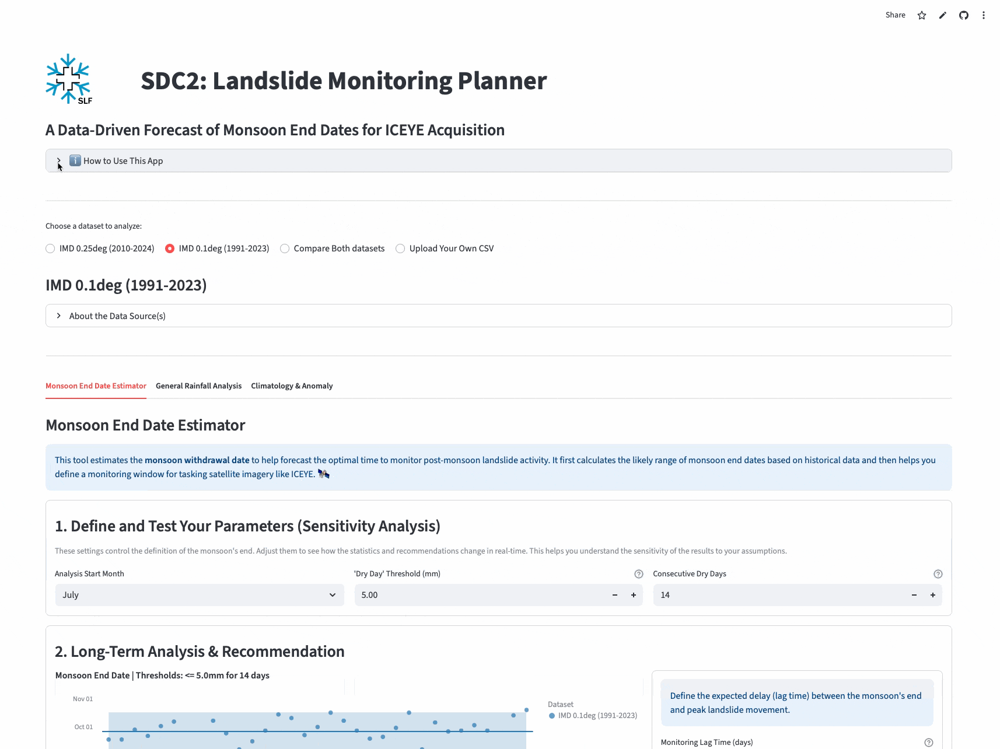

# SLF SDC2: Rainfall Data Explorer
## An Interactive Web Application for Rainfall Analysis

[](https://www.python.org/) [](https://streamlit.io) [](https://opensource.org/licenses/MIT)

**Status:** Actively Developed (as of September 2025)

An interactive web application built with Streamlit for analyzing and visualizing gridded rainfall datasets. This tool allows users to compare different data products, explore rainfall patterns, estimate monsoon withdrawal dates, analyze climatological anomalies, and upload their own time series data.

---

The app is hosted on Streamlit Cloud and can be accessed [here](https://slf-sdc-rainfall-data-explorer.streamlit.app/).



---


## Table of Contents
 - [Features](#features)
 - [Data Sources](#data-sources)
 - [Local Data Processing](#local-data-processing)
 - [Installation & Usage](#installation--usage)
 - [License](#license)

---

## Features
 
The application provides a comprehensive suite of tools for rainfall analysis:
 
### 1. Data Handling & Comparison
- **Multiple Datasets:** Analyze and compare two preloaded, high-resolution Indian rainfall datasets (IMD 0.25° and IPED 0.1°).
- **Custom Data Upload:** Upload your own CSV file with `time` and `rain (mm)` columns for instant analysis.
- **Comparative Visualization:** When comparing datasets, charts are displayed side-by-side for easy interpretation.
 
### 2. Monsoon End Date Estimator
- **Algorithmic Forecasting:** Estimates the monsoon withdrawal date based on a sustained dry period to help plan post-monsoon activities.
- **Sensitivity Analysis:** Interactively fine-tune the algorithm by setting:
    - The **analysis start month** (to avoid pre-monsoon dry spells).
    - The **'dry day' threshold** (mm) to define what counts as a dry day.
    - The required number of **consecutive dry days** to confirm the withdrawal.
- **Statistical Summary:** A dot plot shows the historical distribution of end dates, with the median and 95% confidence interval highlighted.
- **Monitoring Recommendations:** Automatically calculates "Earliest," "Likely," and "Latest" monitoring start dates based on historical data and a user-defined lag time.
 
### 3. General Rainfall Analysis
- **Flexible Timeframes:** View data for a specific year or a custom date range.
- **Multiple Aggregation Levels:** Aggregate rainfall totals as **Daily**, **Weekly**, **Monthly**, or **Yearly**.
- **Key Performance Indicators (KPIs):** Instantly see key stats for the selected period, including Total Rainfall, Average Daily Rainfall, and Peak Rainfall Day.
- **Data Export:** Download aggregated data as a CSV file.
 
### 4. Climatology & Anomaly
- **Long-Term Comparison:** Compare a selected year's daily rainfall against the long-term daily average (climatology) calculated from all other years in the dataset.
- **Dual Visualization:**
    1.  An overlay chart showing the selected year's daily rainfall bars and the long-term average as a line.
    2.  A rainfall anomaly chart, highlighting days that were wetter (blue) or drier (brown) than the historical average.

---


## Data Sources
 
The application uses two preloaded datasets for a location in the Indian Himalayas (**30.463° N, 79.525° E**).
 
#### IMD 0.25deg: Official Gridded Daily Rainfall Data
- **Citation:** Pai, D.S., Sridhar, L., Rajeevan, M. *et al*. Development of a new high spatial resolution (0.25° X 0.25°) long period (1901-2010) daily gridded rainfall data set over India and its comparison with existing data sets over the region. *MAUSAM*, 65(1), pp.1-18 (2014).
- **Description:** This official daily dataset from the IMD is created using Shepard's interpolation method, a form of inverse distance weighting, applied to measurements from a dense national network of rain gauge stations.
 
#### IMD 0.1deg: Indian Precipitation Ensemble Dataset (IPED)
- **Citation:** Peringiyil, A., Saharia, M., O. P., S. *et al.* A station-based 0.1-degree daily gridded ensemble precipitation dataset for India. *Sci Data* **12**, 333 (2025). https://doi.org/10.1038/s41597-025-04474-2
- **Description:** This dataset was developed by applying a locally weighted spatial regression method to data from thousands of IMD rain gauge stations. This approach also incorporates topographical features to produce more accurate estimates, especially in complex terrain. The mean of the 30-member ensemble is used in this application.
 
 ---

## Local Data Processing
 
The repository includes a Python script (`slf-sdc-rainfall-download-data.py`) for processing rainfall data locally. This script can:
 
1.  **Download IMD Data:** Automatically download the official 0.25° gridded data for a specified time range using the `imdlib` library.
2.  **Extract Time Series from NetCDF:** Process raw IPED 0.1° NetCDF (`.nc`) files, find the grid cell closest to a target coordinate, and extract a continuous daily time series.

## Installation & Usage

This guide assumes you have a Mamba/Conda installation. For a new, minimal, open-source setup, we recommend installing Miniforge from the [official repository](https://github.com/conda-forge/miniforge?tab=readme-ov-file#install). Miniforge is pre-configured to use the `conda-forge` channel and includes the fast `mamba` package manager by default.

**Steps:**

1. Clone the repository & navigate into its directory
```bash
git clone "https://github.com/fdenzinger/slf-sdc-rainfall-data-explorer.git" slf-sdc-rainfall-data-explorer
cd slf-sdc-rainfall-data-explorer
```

2. Create and activate the environment with Mamba (this may take a few minutes).

Mamba is a fast, parallel replacement for Conda and comes with Miniforge.
```bash
mamba env create -f env/environment.yml
conda activate slf-sdc-rainfall-data-explorer
```

3. Run the Streamlit app

To run the Streamlit app locally, run the following command in your terminal:

```bash
streamlit run slf-sdc-rainfall-app.py
```

---

## License

This project is licensed under the MIT License. See the [LICENSE](https://github.com/fdenzinger/slf-sdc-rainfall-data-explorer/tree/main?tab=MIT-1-ov-file) file for details.

---

## Collaborators

The project is developed by the following contributors:

<div align="left">
  <a href="https://github.com/fdenzinger">
    <br>
    Florian Denzinger
  </a>
</div>

---
© 2025 WSL Institute for Snow and Avalanche Research SLF
